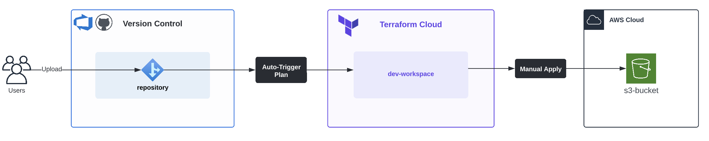

# Create S3 Bucket: aws0001
This project will be to create an S3 bucket that blocks public access. The main objective of this project is to verify Terraform Cloud integration.

### Workflow
Respository (AzureDevOps/GitHub) -> Terraform Cloud (Workspaces) -> AWS Account (dev/prod)

