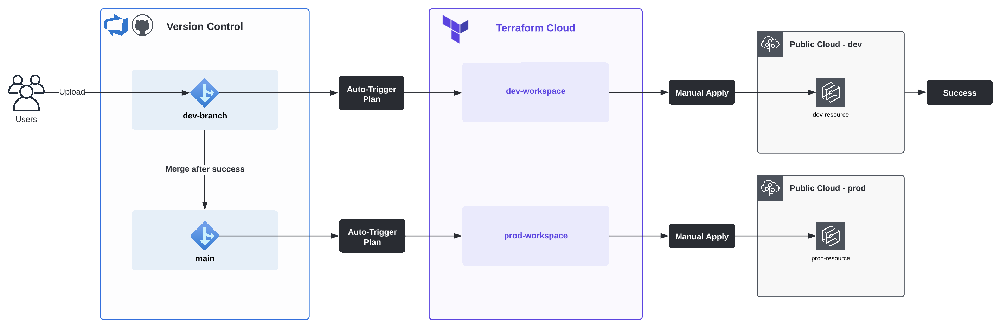

# Integration with Terraform Cloud
This repository will hold the contents of .tf configuration files for projects built on AWS, Azure, and GCP. It will also reference modules used to test the standardization of various types of common resources. The ultimate goal is to automate deployments by integrating Version Control with Terraform Cloud.

### Workflow
The projects in this repository are created by Terraform Cloud using Remote runs as shown in this diagram:

## Modules
Modules are primarily controlled and versioned via GitHub but also referenced using Teraform Cloud's _Private Module Registry_ feature. Below is a workflow of how modules are maintained and used:

The following is a list of available modules to reference:
- [s3](https://github.com/carlos-castillo-a/s3-module)

## AWS
The following is a list of projects connected to AWS:
- [aws0001](./AWS/aws0001/): Creating an S3 bucket
- [aws0002](./AWS/aws0002/): Create S3 bucket via module

## Azure
Azure projects are TBD.

## Google Cloud Platform
GCP projects are TBD.