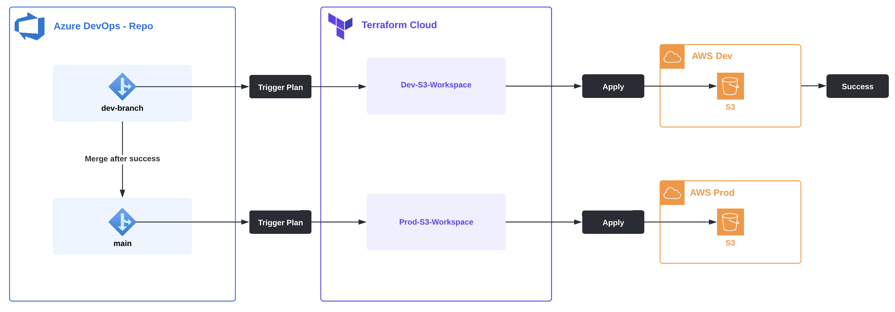

# Integration with Terraform Cloud
This repository will hold the contents of .tf configuration files for projects in AWS and Azure. It will also contain modules used to test the standardization of various types of common resources. The ultimate goal is to automate deployments by integrating Version Control with Terraform Cloud.

## AWS
The following is a list of projects connected to AWS:
- [aws0001](./AWS/aws0001/): Creating an S3 bucket
- [aws0002](./AWS/aws0002/): Create EC2 Instance

**Workflow**  

### Order of operations 
1. Create `dev` Branch for project (ex: `aws0000-dev`)
2. Create Terraform Cloud `[project]-dev` Workspace tied to dev branch (ex: `aws0000-dev`)
3. Create Terraform Cloud `[project]-prod` Workspace tied to `main` branch
4. Test Configuration in dev, once successful, merge changes to `main`

## Azure
Azure projects are TBD.

## Google Cloud Platform
GCP projects are TBD.